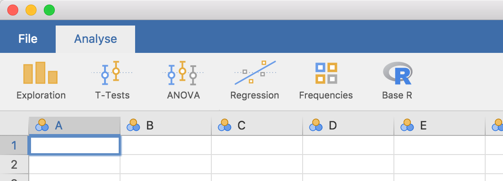

Before we begin, analyses in jamovi are written in the **R programming language**. This tutorial assumes you have a basic understanding of R and some experience with R packages.

In this guide, you will:
1.  **Install** `jmvtools` for module development.
2.  **Connect** `jmvtools` to your jamovi installation.
3.  **Build and install** an example module from source.

## 1. Install `jmvtools`

The `jmvtools` package provides the essential tools for building and debugging jamovi modules. You can find the source code on the [jmvtools GitHub page](https://github.com/jamovi/jmvtools). 

To install it, run the following command in your R console. Note that we are using the `repos` argument to tell R to look in the official **jamovi repository** (our private server for jamovi-specific packages) in addition to CRAN:

```r
install.packages('jmvtools', repos=c('https://repo.jamovi.org', 'https://cran.r-project.org'))
```

## 2. Connect to jamovi

Once installed, verify that `jmvtools` can locate your jamovi application. Run:

```r
jmvtools::check()
```

`jmvtools` automatically searches standard locations (the **source tree** or file system) such as:
*   **macOS:** `/Applications`
*   **Linux:** `/usr/lib/jamovi`
*   **Windows:** `C:\Program Files`

> [!NOTE]
> ### Manually specifying the path
> If `jmvtools` cannot find jamovi, you can manually point to the installation directory:
>
> ```r
> # Example for a custom path
> jmvtools::check(home='C:\\Path\\To\\Your\\jamovi')
> ```
>
> To save this path for your current R session, use:
> ```r
> options(jamovi_home='C:\\Path\\To\\Your\\jamovi')
> ```

## 3. Install your first Module

Now that your environment is ready, let's install the [Base R](https://github.com/jamovi/jmvbaseR) module. 

1.  **Download** the source code: [Download .zip](https://github.com/jamovi/jmvbaseR/archive/master.zip)
2.  **Unzip** the directory and open the `jmvbaseR.Rproj` file in RStudio.
3.  **Start jamovi** (ensure it's running before the next step).
4.  **Install** the module by running:

```r
jmvtools::install()
```

### What happens next?
Switch to your open jamovi window. You should see a new **'Base R'** menu on the ribbon. 



The ability to update analyses directly from R is the core of the jamovi development workflow. In the next section, we'll see how making a change in R is immediately reflected in the jamovi UI. Let's [build your first analysis](/tutorial/tuts0102-building-your-first-analysis).
