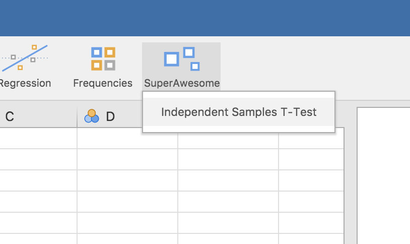
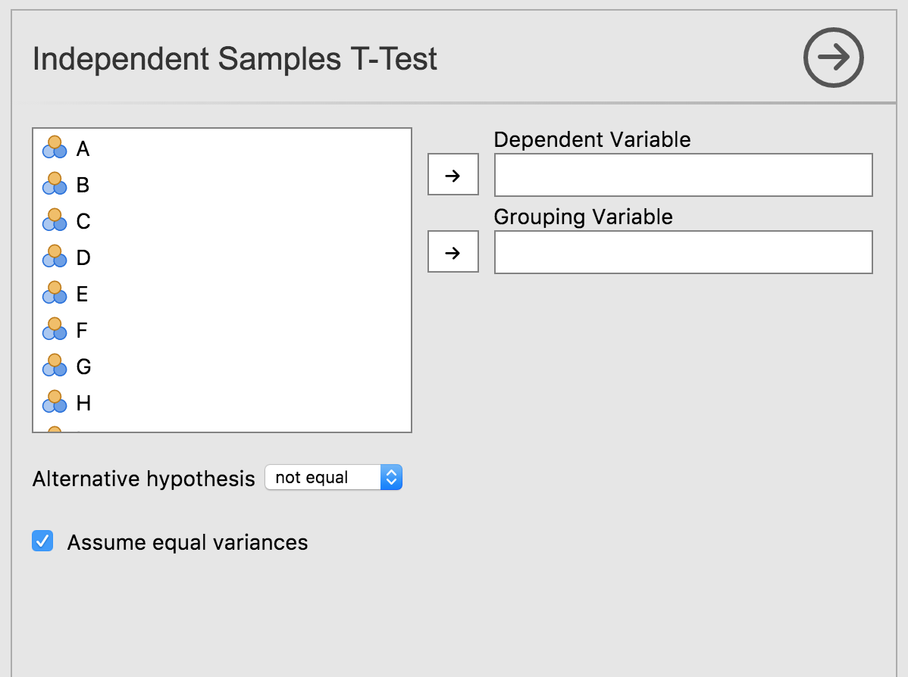

In this section, we will create a jamovi module from scratch and add an **Independent Samples T-Test**. This builds on the environment we set up in the [Getting Started](/tutorial/tuts0101-getting-started) guide.

## 1. Scaffold the Module

The easiest way to create a module is with the `create()` function. Open your R console and run:

```r
jmvtools::create('SuperAwesome')
```

This command creates a new directory called `SuperAwesome` in your **source tree** (your project's file structure). If you open the folder, you will find:

```text
SuperAwesome/
├── DESCRIPTION          # Standard R package metadata
├── NAMESPACE            # Standard R package namespace
├── jamovi/              # jamovi-specific configuration (The "Manifest")
│   └── 0000.yaml        
└── R/                   # R source code directory
```

> [!TIP]
> **The "Dual Citizen" Concept:** 
> jamovi modules **are** standard R packages. This means they can be built, installed, and used in an R session like any other library, but the `jamovi/` directory contains the "Dual Citizenship" papers that allow them to run inside the jamovi application.

## 2. Add an Analysis

To add an analysis template to your module, use `addAnalysis()`. Ensure your working directory is set to the `SuperAwesome` folder first:

```r
setwd('SuperAwesome')
jmvtools::addAnalysis(name='ttest', title='Independent Samples T-Test')
```

## 3. The 5-File Structure

This command generates five files for your analysis. While it may seem like a lot, this separation of concerns makes your code easier to maintain:

| File | Type | Purpose |
| :--- | :--- | :--- |
| `ttest.a.yaml` | **Contract** | Defines the options (UI) and the "jas" (jamovi analysis spec). |
| `ttest.r.yaml` | **Results** | Defines the "jrs" (jamovi results spec) and the layout of tables and plots. |
| `ttest.u.yaml` | **UI** | Automatically generated file that handles the layout of the sidebar. You rarely need to touch this. |
| `ttest.h.R` | **Header** | Automatically generated R code that bridges the UI to your logic. **Never edit this file.** |
| `ttest.b.R` | **Body** | This is your workspace. This is where you write the actual R logic. |

## 4. The Analysis Definition (`.a.yaml`)

Open `jamovi/ttest.a.yaml`. This file uses **YAML**, a human-readable format for structured data. 

> [!IMPORTANT]
> **YAML Rule #1:** Indentation matters! Always use spaces (not tabs) for nesting items.

```yaml
---
name:  ttest
title: Independent Samples T-Test
jas:   "1.2"  # jamovi analysis spec (tells jamovi which API version to use)
version: "1.0.0"

options:
    - name: data
      type: Data
...
```

### Mapping YAML to the UI
*   **Variable:** Creates a "drop target" for data columns.
*   **List:** Creates a dropdown menu for options.
*   **Bool:** Creates a checkbox.

## 5. Verify the UI

Install the module to see your new menu in jamovi:

```r
jmvtools::install()
```

In jamovi, you will now see the **SuperAwesome** menu with your **Independent Samples T-Test**:





**Next Step:** Your analysis has a beautiful UI, but it doesn't perform any calculations yet. Let's [implement the R logic](/tutorial/tuts0103-implementing-an-analysis).
