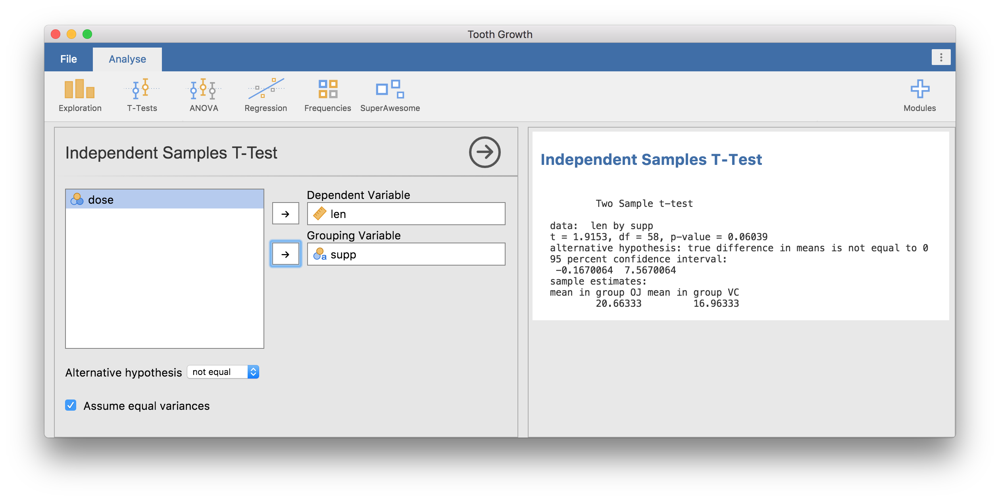

In this section, we will add the R code to perform our t-test calculations. This builds on the [UI we created in the previous section](/tutorial/tuts0102-building-your-first-analysis).

## 1. Locate the Implementation File

In jamovi, the analysis logic lives in the `.b.R` file. Open `R/ttest.b.R` in your editor. You will see a generated template:

```r
ttestClass <- R6::R6Class(
    "ttestClass",
    inherit = ttestBase,
    private = list(
        .run = function() {
            # Your code goes here
        })
)
```

> [!NOTE]
> ### What is R6?
> jamovi uses the **R6** object-oriented system. Instead of writing simple functions, we write a **Class**. 
> - **inherit = ttestBase:** Inherits the core plumbing from jamovi.
> - **private = list(.run = ...):** This is where you put your code.
> - **self:** Use this keyword to access the analysis' data, options, and results (e.g., `self$options`).

## 2. Writing the Logic

Let's implement the t-test. We'll start by calling the standard R `t.test()` function. Note that we access it using the **full namespace** (`stats::t.test`). This is a best practice that ensures your code is fast and robust.

```r
ttestClass <- R6::R6Class("ttestClass",
    inherit=ttestBase,
    private=list(
        .run=function() {
            # 1. Construct the formula (e.g., "len ~ supp")
            formula <- jmvcore::constructFormula(self$options$dep, self$options$group)
            formula <- as.formula(formula)
        
            # 2. Run the analysis (using the stats namespace)
            results <- stats::t.test(formula, self$data, var.equal=self$options$varEq)
        
            # 3. Populate the results panel
            self$results$text$setContent(results)
        })
)
```

> [!TIP]
> **Why use `jmvcore::constructFormula`?**
> Always use this function instead of `paste()`. It automatically handles column names with spaces (e.g., `"the fish"`) by adding backticks, preventing your analysis from crashing.

## 3. Install and Test

Install the updated module:

```r
jmvtools::install()
```

### Test in jamovi
1.  Go to **File -> Examples -> Tooth Growth**.
2.  Select **SuperAwesome -> Independent Samples T-Test**.
3.  Assign `len` to **Dependent Variable** and `supp` to **Grouping Variable**.

### Test in R
Since jamovi modules are R packages, you can also test them in your R console. Here, we use `devtools` to install it as a standard package:

```r
# Install for the R console
devtools::install()

library(SuperAwesome)
data(ToothGrowth)
ttest(data=ToothGrowth, dep='len', group='supp')
```

### Results



**Next Step:** The raw text output is functional, but jamovi users expect beautiful, interactive tables. Let's understand [how jamovi results work](/tutorial/tuts0104-results-mental-model).
