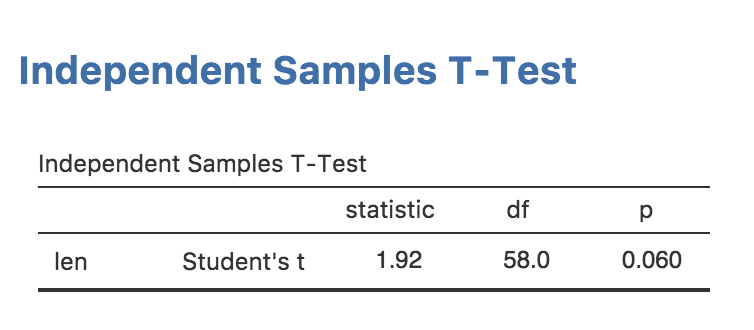
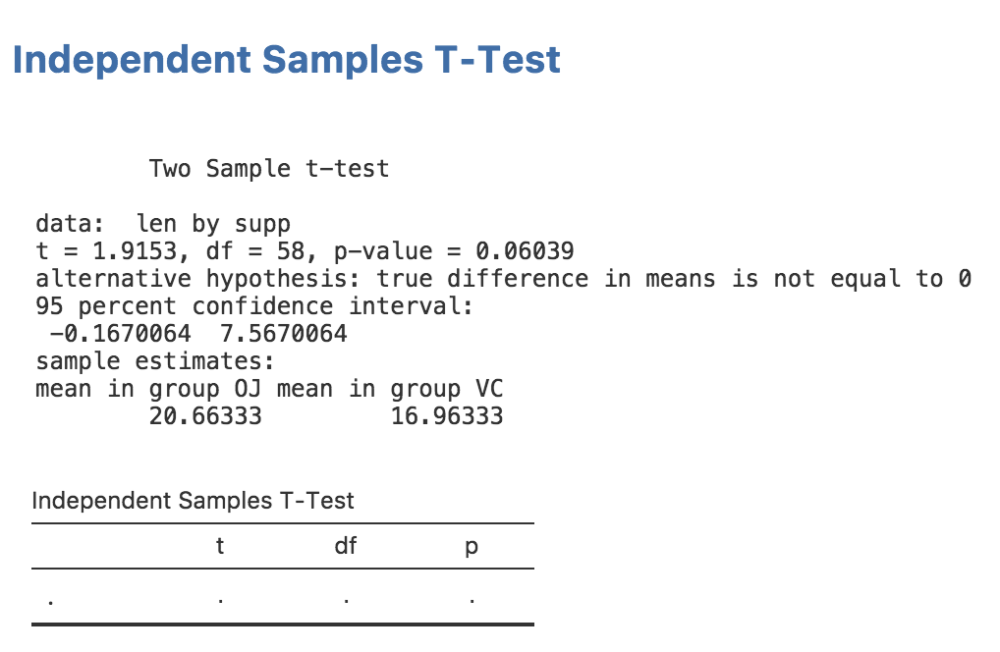
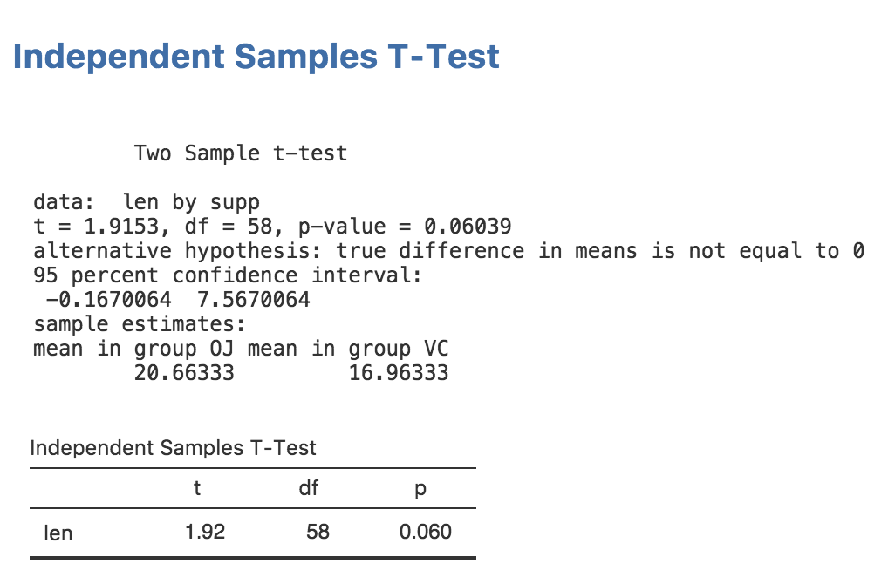
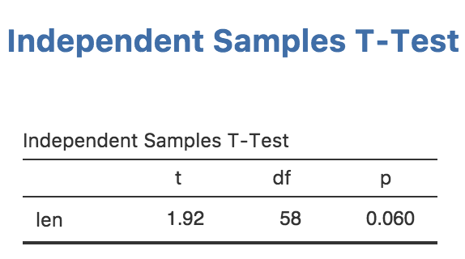

In this section, we will add rich results to our analysis—a professional, formatted table like this:



## 1. The Results Definition (`.r.yaml`)

To provide rich results, we add entries to `jamovi/ttest.r.yaml`. 

```yaml
---
name:  ttest
title: Independent Samples T-Test
jrs:   '1.1' # jamovi results spec

items:
    - name:  text
      title: Independent Samples T-Test
      type:  Preformatted
```

*   **jrs:** Like the `jas` in your analysis definition, this tells jamovi which results API to use.
*   **type: Preformatted:** This is a simple container for raw text output. We've been using this so far with `setContent()`.

## 2. Adding a Table

Modify `ttest.r.yaml` to include a table:

```yaml
# ... (existing text item)
    - name:  ttest
      title: Independent Samples T-Test
      type: Table
      rows:  1
      columns:
        - name: var
          title: ''
          type: text
        - name: t
          type: number
        - name: df
          type: integer
        - name: p
          type: number
          format: zto,pvalue
```

*   **type: Table:** Reserves space for a structured table.
*   **format: zto,pvalue:** `zto` (zero-to-one) ensures consistent decimal places, and `pvalue` automatically handles small p-values (e.g., `< .001`).

## 3. Populating the Table

In `R/ttest.b.R`, we need to extract values from the R t-test object and "pour" them into the table.

> [!NOTE]
> ### Handling R Objects
> R functions return different types of objects (S3, S4, or Lists). You can use `names(results)` to see what's inside. For `t.test`, we can access values using the `$` operator.

```r
.run=function() {
    # ... (existing calculation)
    results <- stats::t.test(formula, self$data, var.equal=self$options$varEq)

    # 1. Access the table object
    table <- self$results$ttest

    # 2. Fill in the row
    table$setRow(rowNo=1, values=list(
        var = self$options$dep,
        t   = results$statistic,
        df  = results$parameter,
        p   = results$p.value
    ))
}
```

Now, reinstall your module with `jmvtools::install()`. You should see your beautiful, formatted table appear in jamovi!

Initially the table will be empty:



But once we populated it correctly, it will be filled:



Finally, it will look like this:



**Next Step:** Now that your analysis produces rich results, let's learn how to [debug and handle errors](/tutorial/tuts0106-debugging-an-analysis).
