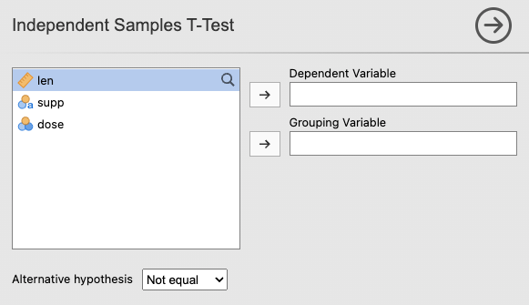
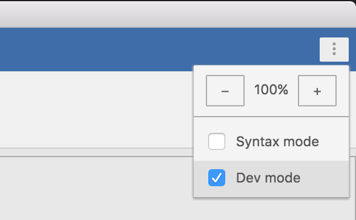
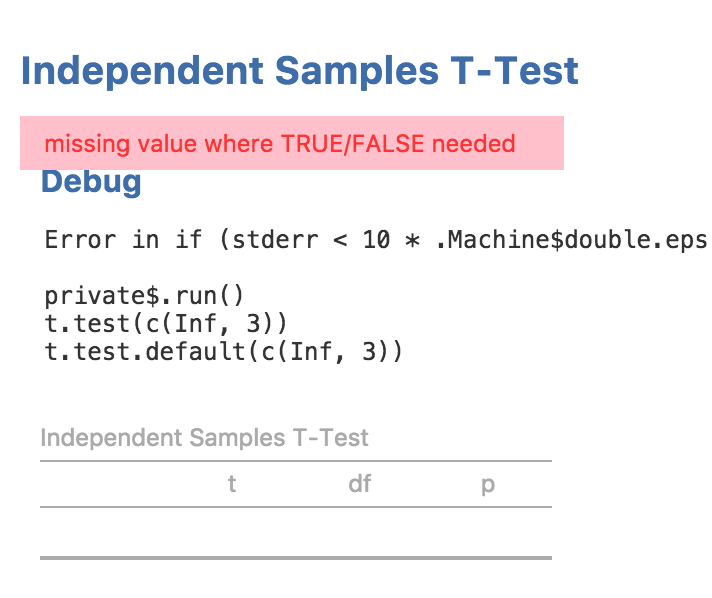
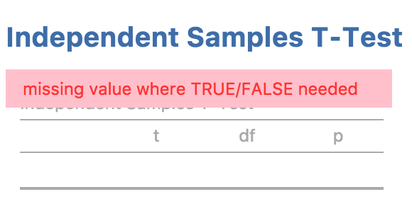
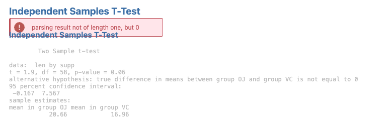

Even the best-written analyses encounter errors. In this section, we'll cover two essential debugging skills:
1.  **Input Checks (Early Returns):** Preventing errors when the user hasn't finished setting up the analysis.
2.  **Dev Mode:** Accessing advanced stack traces to troubleshoot R logic errors.

## 1. Using Input Checks

By default, jamovi tries to run your analysis as soon as it's selected. If the user hasn't provided the required inputs yet, R might throw a confusing error message.

### The Problem
Try removing both `len` and `supp` from your analysis in jamovi.



You will see an error message (like `length 0`) in the results panel. This isn't a "bug"—it's just that the analysis is trying to run without data. This creates a "flickering" or laggy feel for the user.

### The Solution: Exit Early
We can add an **Input Check** (also known as an Early Return) to the top of our `.run()` function. This tells R: "If the required options are empty, stop here and don't show an error."

Modify your `R/ttest.b.R`:

```r
ttestClass <- R6::R6Class(
    "ttestClass",
    inherit = ttestBase,
    private = list(
        .run = function() {

            # 1. Input Check: Stop if inputs are missing
            if (length(self$options$dep) == 0 || length(self$options$group) == 0) {
                return()
            }
            
            # 2. Existing analysis logic...
            formula <- jmvcore::constructFormula(self$options$dep, self$options$group)
            formula <- as.formula(formula)
            
            results <- stats::t.test(formula, self$data, var.equal=self$options$varEq)
            
            # Populate our table (created in the previous section)
            table <- self$results$ttest
            table$setRow(rowNo=1, values=list(
                var = self$options$dep,
                t   = results$statistic,
                df  = results$parameter,
                p   = results$p.value
            ))
        })
)
```

Now, the results panel will remain clean until all variables are assigned, providing a much smoother user experience.

## 2. Enabling "Dev Mode"

When you have a real bug in your R logic, you need a **Stack Trace** to find the exact line responsible for the crash.

### Step 1: Toggle Dev Mode
In jamovi, the default view hides complex technical details. To see more:

1.  Click the **App Menu** (three dots in the top-right corner).
2.  Toggle **Developer Mode** to **On**.



### Step 2: Inspect the Stack Trace
With Dev Mode on, any R error will display a full stack trace. This allows you to trace the error back through your functions to find the bug.



> [!TIP]
> **Keep it on!** 
> Most jamovi developers leave Dev Mode on permanently during the development process. It's the fastest way to get immediate feedback.

If there is an error in your code, jamovi will show an error message in the results panel:



And for the user, it will look like this:



**Next Step:** Now that you can troubleshoot your code, let's [add plots](/tutorial/tuts0107-adding-plots) to make your results even more insightful.
