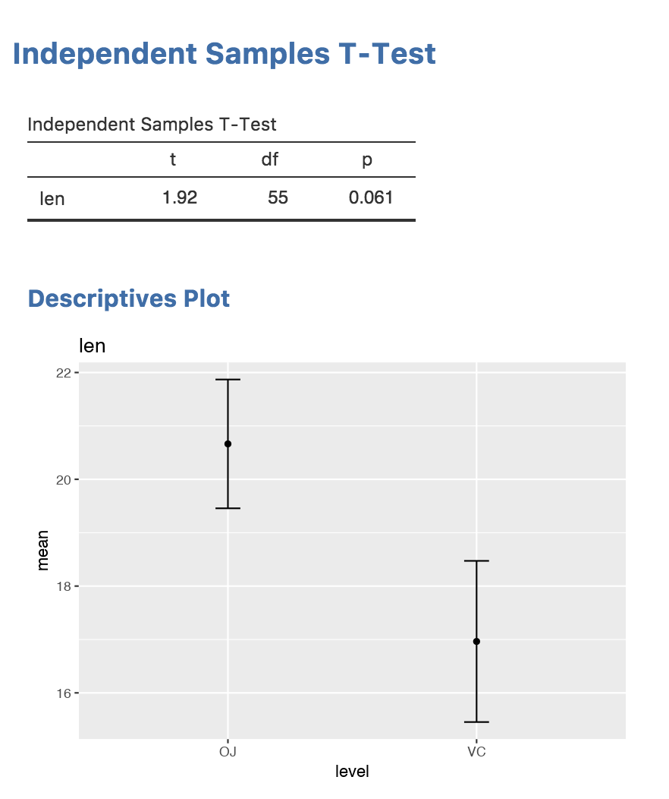

In this section, we'll add a visual representation of our data. jamovi makes it easy to integrate `ggplot2` to create beautiful plots.

## 1. Define the Image in YAML

Plots are items in your results, so we need to add an `Image` entry to `jamovi/ttest.r.yaml`.

```yaml
# ... (existing ttest table)
    - name: plot
      title: Descriptives Plot
      type: Image
      width:  400
      height: 300
      renderFun: .plot
```

> [!NOTE]
> **The Dot Prefix:**
> Notice the `renderFun: .plot`. In jamovi, the dot prefix indicates that the rendering function is a **private** method of your R6 class. This keeps your public API clean while allowing the jamovi framework to call the method internally.

## 2. Configure Dependencies

To use `ggplot2`, your module must declare it as a dependency in two files located in your project's root directory:

1.  **`DESCRIPTION`**: Add `ggplot2` to the `Imports:` field. This tells R that your module requires this package to be installed.
    ```text
    Imports: jmvcore, R6, ggplot2
    ```
2.  **`NAMESPACE`**: Add an import statement so the functions are available to your module.
    ```text
    import(ggplot2)
    ```

## 3. The Plotting Model: State vs. Render

jamovi uses a two-stage system: **Calculate data in `.run()`, draw it in `.plot()`.**

By saving data to the `state`, jamovi can redraw the plot instantly if the user resizes the window or changes a theme, without needing to re-run the entire analysis. This separation of concerns is key to a responsive UI.

> [!TIP]
> **Performance Tip:**
> Summarizing your data in `.run()` before passing it to the plot state is a best practice. It keeps the state object small and ensures the `.plot()` function remains fast. See [Image State Performance](/tutorial/tuts0301-image-state-performance) for more details.

## 4. Implementation in R

Open `R/ttest.b.R` and update your class definition.

```r
ttestClass <- R6::R6Class("ttestClass",
    inherit = ttestBase,
    private = list(
        .run = function() {
            # ... (existing calculation)

            dep     <- self$options$dep
            group   <- self$options$group
            formula <- jmvcore::constructFormula(dep, group)
            formula <- as.formula(formula)

            means <- aggregate(formula, self$data, mean)[, 2]
            ses   <- aggregate(formula, self$data, function(x) sd(x) / sqrt(length(x)))[, 2]

            sel <- means - ses
            seu <- means + ses
            levels <- base::levels(self$data[[group]])

            plotData <- data.frame(
                level = levels,
                mean  = means,
                sel   = sel,
                seu   = seu
            )

            image <- self$results$plot
            image$setState(plotData)
        },

        .plot = function(image, ...) {
            # 'image' is the R6 object representing the Image element
            # '...' allows for future arguments from the rendering system

            plotData <- image$state

            if (is.null(plotData))
                return(FALSE)

            p <- ggplot(plotData, aes(x = level, y = mean)) +
                geom_errorbar(aes(ymin = sel, ymax = seu), width = 0.1) +
                geom_point()

            # ggplot2 objects must be explicitly printed to the active device
            print(p)

            # Return TRUE to notify jamovi that rendering was successful
            TRUE
        }
    )
)
```

### Why the extra logic?

*   **`print(p)`**: Unlike in an interactive R session where plots appear automatically, inside a function you must explicitly call `print()` to send the `ggplot2` object to the graphics device.
*   **`return(TRUE)`**: This tells jamovi that the plot was rendered successfully. If you return `FALSE` (or nothing), jamovi will assume the plot is empty or failed and won't display it.

## 5. Test your Plot

Run `jmvtools::install()` in your R console. Open jamovi, select your analysis, and drag some variables into the slots. You should see your plot appear!

And the result will look like this:



> [!TIP]
> **Going Further:**
> You've just created your first plot! When you're ready for more advanced techniques, check out:
> - **[Image State Performance](/tutorial/tuts0301-image-state-performance):** Learn how to optimize plots for large datasets.
> - **[Plot Themes](/tutorial/tuts0302-plot-themes):** Deep-dive into jamovi's color palettes and styling.
> - **[Responsive Image Sizing](/tutorial/tuts0303-responsive-image-sizing):** Make your plots adapt to different container sizes.

**Next Step:** Your basic analysis is complete! Now let's explore more advanced topics, starting with the **[Analysis Lifecycle](/tutorial/tuts0200-analysis-lifecycle)**.
