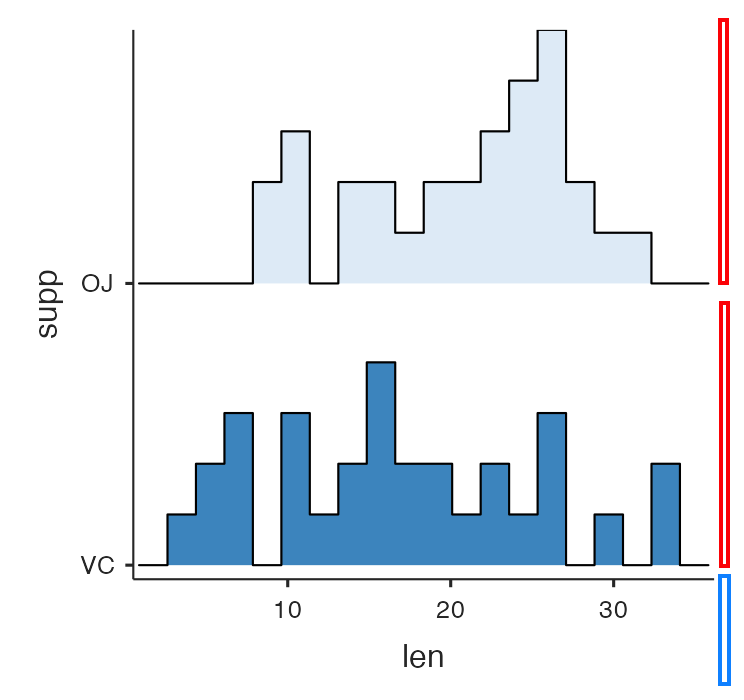

When a user resizes a plot in jamovi, they expect it to behave intelligently. A simple "stretch-to-fit" approach often fails because certain elements—like axis labels, margins, and legends—should remain a constant size, while the data area should expand or contract.

To create a truly "native" feel, you need to define how your image responds to resizing.

## The Mental Model: Fixed vs. Stretchable

To create plots that scale intelligently, you must distinguish between space that **must stay constant** and space that **should expand**.

1.  **Fixed Area (B for "Base"):** Elements that don't change size when the plot is resized. This includes axis titles, tick labels, and margins.
2.  **Stretchable Area (M for "Multiplier"):** The actual data-carrying part of the plot (e.g., the facets, the plotting area).

> [!NOTE]
> **The Core Formula**
> The relationship between these two is:
> **Total Dimension = M + B**



In the image above:
- The **blue** areas are **Fixed**. They take up the same number of pixels regardless of the total image size.
- The **red** areas are **Stretchable**. They expand or contract to fill the available space.

## The Problem with Simple Scaling

Imagine a plot with 2 rows of facets. You've set it to look perfect at 600px height. If the user adds a third row, jamovi needs to know how much to increase the height to keep the facets looking the same. 

If you just scale the whole image by 50%, the axis labels and margins also grow by 50%, which looks "off."

## The Solution: `setSize2`

The `setSize2` method allows you to specify exactly how much of your plot is stretchable and how much is fixed.

```r
self$results$plot$setSize2(widthM, heightM, widthB, heightB) # widthM, heightM, widthB, heightB
```

- **widthM / heightM:** The "Multiplier" or stretchable dimensions.
- **widthB / heightB:** The "Base" or fixed dimensions.

### Example: Faceted Plots

Suppose you have a plot where each row of facets should be 250px tall, and your axes/margins take up 100px.

**Calculate** your dimensions based on the number of rows:

```r
nRows <- length(unique(self$data[[self$options$group]]))
heightM <- 250 * nRows
heightB <- 100

self$results$plot$setSize2(500, heightM, 100, heightB) # widthM, heightM, widthB, heightB
```

Now, when the user resizes the plot, jamovi calculates a scale factor based *only* on the stretchable area, preserving the proportions of your facets while keeping the axes crisp.

## Implementation

**Follow** these steps to implement responsive sizing in your analysis:

### 1. Identify Fixed Dimensions
**Determine** the approximate pixel height of your X-axis and the width of your Y-axis. Usually, 100px is a good starting point for a standard plot.

### 2. Define the Stretchable Unit
**Decide** how many pixels a single "unit" (like a facet or a category) should occupy.

### 3. Apply `setSize2`
**Call** the method in your `.run()` function. 

> [!IMPORTANT]
> **Backward Compatibility**
> The `setSize2` method was introduced in jamovi 2.7.16. To ensure your module works on older versions, always use a guard clause.

```r
# ✅ BEST PRACTICE
image <- self$results$plot

if ( ! is.null(image[["setSize2"]])) {
    # New jamovi: Use responsive sizing
    image$setSize2(500, 250 * nRows, 100, 100) # widthM, heightM, widthB, heightB
} else {
    # Old jamovi: Fallback to fixed sizing
    image$setSize(600, 250 * nRows + 100)
}
```

## Summary Checklist

- [ ] **Did I use a guard clause?** Ensure compatibility with older jamovi versions.
- [ ] **Is my math dynamic?** Base your `heightM` or `widthM` on the number of variables or groups selected.
- [ ] **Did I account for both axes?** Remember that both width and height usually have fixed components.

**Next Step:** Once your analysis is visual and responsive, it's time to ensure it is robust with **[Unit Testing](/tutorial/tuts0108-unit-testing)**.
