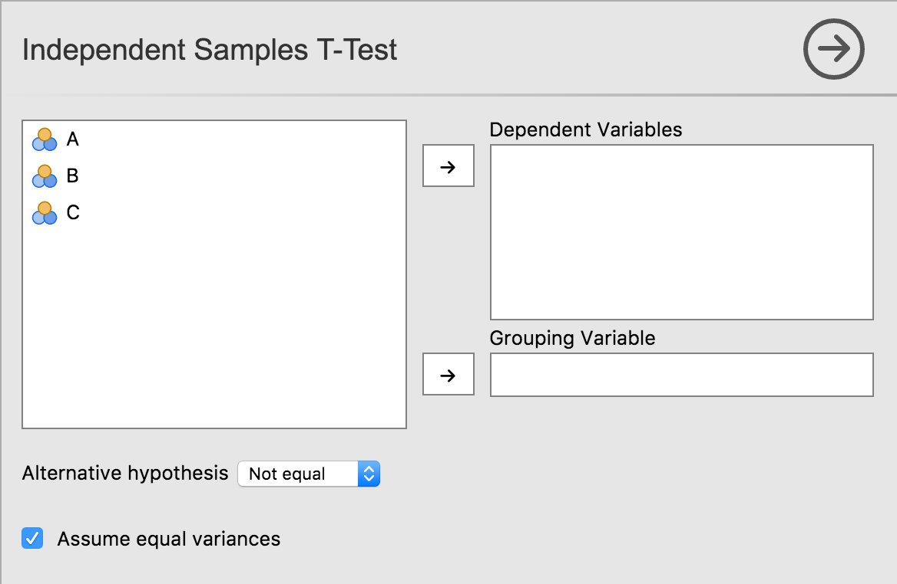

UIs for jamovi analyses are defined in the .u.yaml file (A refresher on the files and the relationship between them is described [here](/tutorial/tuts0103-creating-an-analysis)). This describes what sort of control each option is represented by (i.e. a dropdown list, or some radio buttons), and the order and the layout in which they will appear.

### `aggressive` vs `tame` compiler mode

When you first create an analysis, jamovi manages the `.u.yaml` file for you. This behavior is controlled by the `compilerMode` property:

- **`aggressive` (Default):** Think of this as "Auto-Pilot." Every time you run `jmvtools::install()`, jamovi completely regenerates the UI file based on your `a.yaml` options. This is perfect when you are still adding or removing options, as it ensures the UI always matches your code. **Note:** Any manual changes you make to the `.u.yaml` will be overwritten in this mode.
- **`tame`:** Think of this as "Manual Control." Once you start fine-tuning the layout (e.g., grouping checkboxes, adding custom labels, or adjusting margins), you should switch to `tame` mode. In this mode, `jmvtools` will respect your manual edits and only add new options if it can find a safe place for them.

> [!TIP]
> **Start Aggressive, Stay Tame.** 
> Use `aggressive` mode while you are defining your analysis's core features. Switch to `tame` only when you are ready to "polish" the visual layout.

### UI Best Practices Checklist

To ensure your analysis feels like a native part of jamovi, follow these design principles:

- [ ] **Group Related Options:** Use `LayoutBox` or `CollapseBox` to group related checkboxes (e.g., "Assumption Checks" or "Additional Statistics").
- [ ] **Use Standard Margins:** Apply `margin: large` to top-level `LayoutBox` elements to give the UI room to breathe.
- [ ] **Order by Importance:** Place the most critical inputs (like variable selection) at the top.
- [ ] **Label Clearly:** Use sentence case for labels (e.g., "Equal variances assumed" instead of "Equal Variances Assumed").
- [ ] **Avoid Clutter:** If an analysis has many advanced options, hide them inside a `CollapseBox` that is closed by default.

### Controls

As we've seen earlier in this tutorial series with our t-test example, each option is represented by one or more controls. Our list option was represented by a list box, boolean options were represented by checkboxes, and Variable options were represented as a box that variables could be dragged to.

Let's take a look at UI, and the .u.yaml file which is responsible for it:



```yaml
title: Independent Samples T-Test
name: ttestIS
jus: '3.0'
stage: 0
compilerMode: aggressive

children:

  - type: VariableSupplier
    persistentItems: false
    stretchFactor: 1
    children:

      - type: TargetLayoutBox
        label: Dependent Variables
        children:
          - type: VariablesListBox
            name: deps
            isTarget: true

      - type: TargetLayoutBox
        label: Grouping Variable
        children:
          - type: VariablesListBox
            name: group
            maxItemCount: 1
            isTarget: true

  - type: LayoutBox
    margin: large
    children:
      - type: ComboBox
        name: alt

  - type: LayoutBox
    margin: large
    children:
      - type: CheckBox
        name: varEq
```

As can be seen, controls are arranged in a hierarchy. At the very top is a control of type `VariableSupplier`. It has two children: `deps` of type `VariablesListBox` and `group` of type `VariableListBox`. Together, these three controls create the variables list, and the 'Dependent Variables' and 'Grouping Variable' drop targets.

Next is a `LayoutBox` which contains the hypothesis `ComboBox`, followed by another `LayoutBox` containing the equality of variances `CheckBox`. By default, items are laid out in a grid from top to bottom.

### Layout and Grouping

You can control how items are arranged using the `style` property of a `LayoutBox`:
- `list` (default): Children are arranged vertically.
- `inline`: Children are arranged horizontally.

To add a heading or a custom label to a group of controls, you can use a `Label` control or wrap controls in a `LayoutBox` with a `label` property (like a `CollapseBox`).

For more advanced layouts, you can use the `cell` property on child controls to place them in a specific grid position within a `LayoutBox`.

See the [LayoutBox](/ui/layoutbox) and [CollapseBox](/ui/collapsebox) documentation for more details.

**Next Step:** Take your UI further with **[Advanced UI Design](/ui/advanced-design)**.
